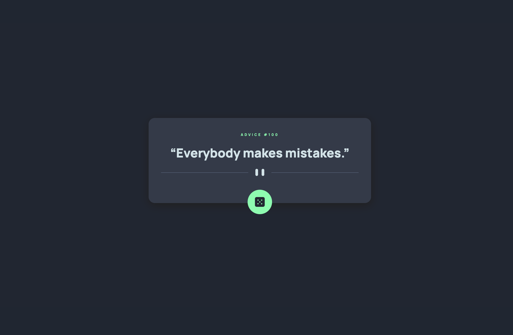

# Frontend Mentor - Advice generator app solution

This is a solution to the [Advice generator app challenge on Frontend Mentor](https://www.frontendmentor.io/challenges/advice-generator-app-QdUG-13db). Frontend Mentor challenges help you improve your coding skills by building realistic projects.

## Overview

### The challenge

Users should be able to:

- View the optimal layout for the app depending on their device's screen size
- See hover states for all interactive elements on the page
- Generate a new piece of advice by clicking the dice icon

### Screenshot



### Links

- [Solution](https://github.com/Rosenval/advice-generator-app.git)
- [Live Site](https://flamiapp.netlify.app/)

### Built with

- Semantic HTML5 markup
- CSS custom properties
- Flexbox
- Vanilla JavaScript

### What I learned

I learned how to fetch data from an third-party API

```
function getAdvice() {
    fetch('https://api.adviceslip.com/advice')
    .then((response) => response.json())
    .then((data) => {
        title.innerHTML = `ADVICE #${data.slip.id}`;
        advice.innerHTML = `“${data.slip.advice}”`;
    });
}
```

## Author
- Frontend Mentor - [@yourusername](https://www.frontendmentor.io/profile/yourusername)

### Collaborators
- Frontend Mentor - [@tylerdurden230](https://www.frontendmentor.io/profile/tylerdurden230)
